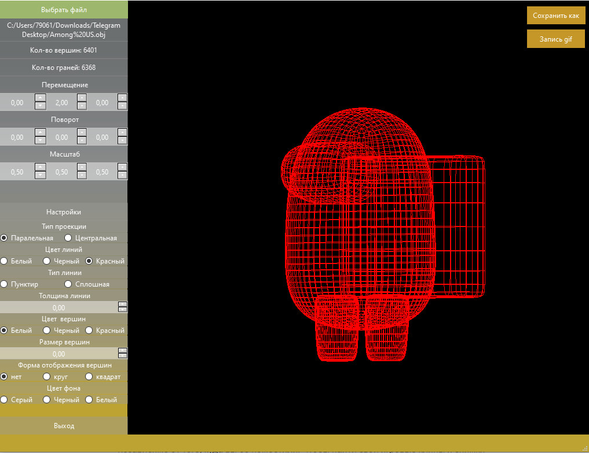
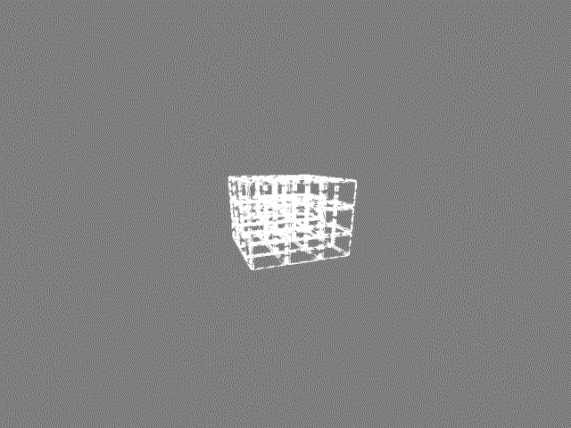
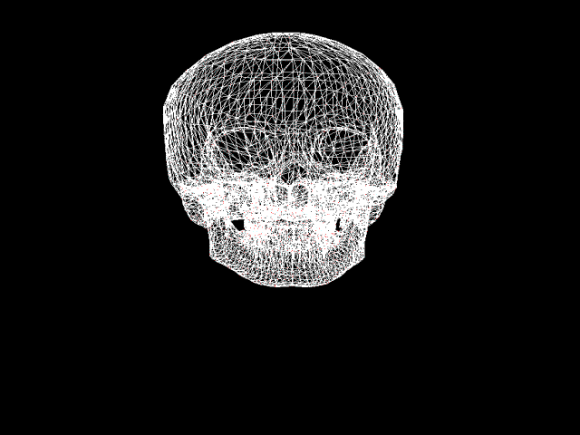

# 3DViewer v2.0

Реализация приложения для просмотра 3D моделей в каркасном виде, которые надо загружать из .obj файлов и иметь возможность просматривать их на экране с возможностью вращения, масштабирования и перемещения.

## Part 1. 3DViewer v2.0

- Сборка программы настроена с помощью Makefile со стандартным набором целей для GNU-программ: all, install, uninstall, clean, dvi, dist, tests.
- Полное покрытие unit-тестами модулей, связанных с загрузкой моделей и аффинными преобразованиями
- Программа предоставляет возможность:
    - Загружать каркасную модель из файла формата obj (поддержка только списка вершин и поверхностей).
    - Перемещать модель на заданное расстояние относительно осей X, Y, Z.
    - Поворачивать модель на заданный угол относительно своих осей X, Y, Z.
    - Масштабировать модель на заданное значение.
- Реализован графический пользовательский интерфейс на базе Qt
- Графический пользовательский интерфейс содержит:
    - Кнопку для выбора файла с моделью и поле для вывода его названия.
    - Зону визуализации каркасной модели.
    - Кнопку/кнопки и поля ввода для перемещения модели. 
    - Кнопку/кнопки и поля ввода для поворота модели. 
    - Кнопку/кнопки и поля ввода для масштабирования модели.  
    - Информацию о загруженной модели - название файла, кол-во вершин и ребер.
- Программа корректно обрабатывается с деталями до 1 000 000 вершин без зависания

## Part 2. Дополнительно. Настройки

- Программа позволяет настраивать тип проекции (параллельная и центральная)
- Программа позволяет настраивать тип (сплошная, пунктирная), цвет и толщину ребер, способ отображения (отсутствует, круг, квадрат), цвет и размер вершин
- Программа позволяет выбирать цвет фона
- Настройки сохраняются между перезапусками программы

## Part 3. Дополнительно. Запись
 

- Программа позволяет сохранять отрендеренные изображения в файл в форматах bmp и jpeg
- Программа позволяет по специальной кнопке записывать небольшие "скринкасты" - текущие пользовательские аффинные преобразования загруженного объекта в gif-анимацию (640x480, 10fps, 5s)